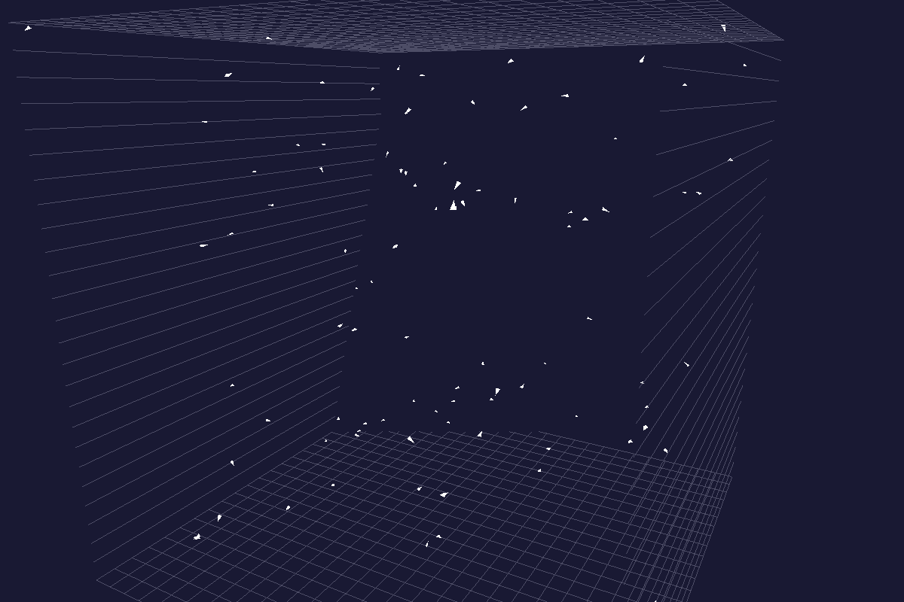

# Boids-Algo: Simulation 3D de l'Algorithme Boids

Ce dépôt contient une simulation 3D de l'algorithme Boids, implémenté en Python avec Pygame et OpenGL. L'algorithme Boids simule le comportement de vol des oiseaux, de la nage des poissons ou du regroupement des insectes, en se basant sur trois règles simples : la séparation, l'alignement et la cohésion.

## Table des matières

  * [Description](https://www.google.com/search?q=%23description)

  * [Fonctionnalités](https://www.google.com/search?q=%23fonctionnalit%C3%A9s)

  * [Installation](https://www.google.com/search?q=%23installation)

  * [Utilisation](https://www.google.com/search?q=%23utilisation)

  * [L'Algorithme Boids](https://www.google.com/search?q=%23lalgorithme-boids)

  * [Configuration](https://www.google.com/search?q=%23configuration)

  * [Captures d'écran](https://www.google.com/search?q=%23captures-d%C3%A9cran)

  * [Contribution](https://www.google.com/search?q=%23contribution)

  * [Licence](https://www.google.com/search?q=%23licence)

## Description

Ce projet vise à visualiser le comportement émergent d'un groupe d'agents (les "boids") dans un environnement 3D. Chaque boid suit un ensemble de règles locales pour interagir avec ses voisins, ce qui conduit à un comportement de groupe réaliste et complexe, tel que des bancs de poissons ou des vols d'oiseaux. La simulation est rendue en 3D à l'aide d'OpenGL, offrant une perspective immersive et interactive.

## Fonctionnalités

  * **Simulation 3D:** Visualisation des boids se déplaçant dans un espace tridimensionnel.

  * **Règles de Boids:** Implémentation des règles de cohésion, d'alignement et de séparation.

  * **Interaction Caméra:** Contrôle interactif de la caméra (rotation et zoom) pour explorer la simulation.

  * **Limites du Monde:** Les boids rebondissent sur les bords du monde simulé.

  * **Personnalisation:** Paramètres ajustables pour modifier le comportement des boids et l'environnement.

## Installation

Pour exécuter cette simulation, vous devez avoir Python installé sur votre système. Ensuite, installez les bibliothèques requises à l'aide de `pip` :

```
pip install pygame PyOpenGL numpy

```

## Utilisation

Une fois les dépendances installées, vous pouvez exécuter la simulation en lançant le script Python :

```
python main.py

```

### Contrôles de la Caméra

  * **Clic gauche + Glisser:** Fait pivoter la caméra autour du centre du monde.

  * **Molette de la souris (vers le haut/bas):** Zoome avant/arrière.

## L'Algorithme Boids

L'algorithme Boids, créé par Craig Reynolds en 1987, est un programme de vie artificielle qui simule le comportement de troupeau. Il est basé sur trois règles simples appliquées à chaque agent (boid) :

1.  **Séparation (Separation):** Chaque boid tente d'éviter de se heurter à ses voisins immédiats. Il s'éloigne des boids trop proches.

2.  **Alignement (Alignment):** Chaque boid essaie de faire correspondre sa vitesse et sa direction à la vitesse et à la direction moyennes de ses voisins.

3.  **Cohésion (Cohesion):** Chaque boid se dirige vers le centre de masse moyen de ses voisins.

Ces règles simples, appliquées localement, donnent naissance à un comportement de groupe complexe et réaliste.

## Configuration

Vous pouvez ajuster les paramètres de la simulation en modifiant les variables au début du fichier `main.py` :

```
# Paramètres de la simulation
WIDTH, HEIGHT = 1200, 800
BACKGROUND_COLOR = (0.1, 0.1, 0.2, 1.0)
BOID_COLOR = (1.0, 1.0, 1.0)
NUM_BOIDS = 100
BOID_SIZE = 0.2
MAX_SPEED = 0.3
MAX_FORCE = 0.07
MARGIN = 5

# Dimensions du monde 3D
WORLD_SIZE = 50

# Paramètres des règles
COHESION_RADIUS = 6.0
ALIGNMENT_RADIUS = 4.0
SEPARATION_RADIUS = 2.5

COHESION_FORCE = 0.015
ALIGNMENT_FORCE = 0.075
SEPARATION_FORCE = 0.075

```

  * `NUM_BOIDS`: Nombre de boids dans la simulation.

  * `WORLD_SIZE`: Taille du cube 3D dans lequel les boids évoluent.

  * `MAX_SPEED`, `MAX_FORCE`: Contrôlent la vitesse maximale et la force maximale que les boids peuvent appliquer.

  * `*_RADIUS`: Définissent la portée de chaque règle (à quelle distance un boid considère ses voisins pour une règle donnée).

  * `*_FORCE`: Définissent l'intensité de chaque force (cohésion, alignement, séparation).

## Captures d'écran


